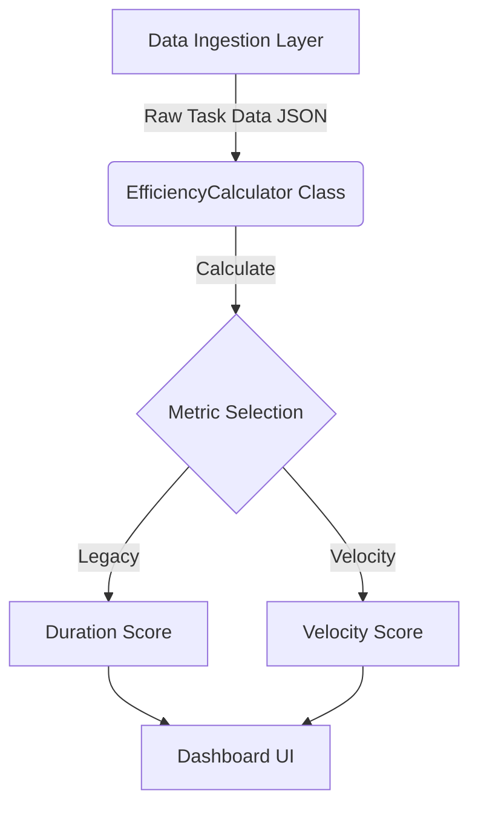

# KABAS Logic Module Architecture

**Module ID**: 2b (Analytics Core)
**Owner**: Logic Analyst
**Status**: Production Ready (v1.0)

## 1. System Context

The **KABAS Logic Module** serves as the mathematical engine for the "Bird's Eye View" Dashboard. It is designed to be decoupled from the Data Ingestion Layer (Scraper), ensuring that business logic remains consistent regardless of the underlying data source (GitHub/Jira).

### Component Diagram (Logic Flow)



---

## 2. Core Components

### 2.1 `EfficiencyCalculator` Class

 The primary entry point for all efficiency analytics. This class is designed to be instantiated once per Team context.

* **File**: `src/EfficiencyCalculator.js`
* **Language**: JavaScript (ES6 / Node.js)
* **Dependencies**: None (Pure Logic)

#### Interface Definition

| Method | Input | Output | Description |
| :--- | :--- | :--- | :--- |
| `addTask(id, hours, status)` | `int, float, string` | `void` | Ingests a raw task record into local state. |
| `setProjectDuration(days)` | `int` | `void` | Sets the denominator for the Legacy formula. |
| `calculateVelocityScore()` | `void` | `float` | **[RECOMMENDED]** Returns tasks completed per man-hour. |
| `calculateLegacyEfficiencyScore()` | `void` | `float` | **[DEPRECATED]** Returns the flawed duration-based score. |

---

## 3. Algorithmic Logic

### 3.1 The Velocity Protocol (Modern)

This is the accepted standard for Agile team assessment within KABAS. It measures the **Instructional Throughput** of a team.

* **Formula**: $$V = \frac{T_{completed}}{H_{total}}$$
* **Variables**:
  * $T_{completed}$: Total count of tasks marked "Done".
  * $H_{total}$: Sum of man-hours logged on all tasks.
* **Interpretation**: Higher is Better. (e.g., 0.5 means "1 task every 2 hours").

### 3.2 The Legacy Metric (Deprecated)

Maintained only for comparative audit purposes to demonstrate the "Duration Flaw".

* **Formula**: $$E = (\frac{H_{total} / T_{completed}}{D_{project}}) \times 100$$
* **Flaw**: Since Project Duration ($D_{project}$) is the denominator, increasing the duration (delaying the project) artificially lowers the score (improves efficiency rating), which incentivizes procrastination.

---

## 4. Integration Strategy

The Logic Module assumes a standard JSON structure from the Scraper Module.

### Example Integration (Node.js)

```javascript
const EfficiencyCalculator = require('./src/EfficiencyCalculator');

// 1. Initialize for a specific team
const calc = new EfficiencyCalculator("Team Alpha");

// 2. Load Data from Database/API
db.tasks.forEach(task => {
    calc.addTask(task.id, task.hours, task.status);
});

// 3. Export Metrics to Dashboard
const report = {
    velocity: calc.calculateVelocityScore(),
    legacy_audit: calc.calculateLegacyEfficiencyScore()
};
```
